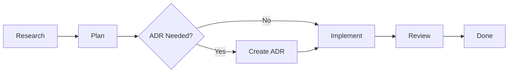

# ACE-FCA Quick Start Guide

Get started with Advanced Context Engineering for Coding Agents in 5 minutes.

## What is ACE-FCA?

A methodology for managing large-scale AI-assisted coding projects through:
- **Context management** (40-60% usage rule)
- **Phase-based workflow** (Research → Plan → Implement → Review)
- **TDD discipline** (test first!)
- **YAGNI principle** (no feature creep)
- **ADR documentation** (preserve decisions)

## 1-Minute Setup

### Option A: GitHub Copilot Integration (Recommended)

```bash
# Copy Copilot templates to workspace
cp -r .github/skills/ace-fca/templates/copilot/* .github/copilot/

# Add core rules to copilot-instructions.md
cat .github/copilot/ace-fca-workflow.instructions.md >> .github/copilot/copilot-instructions.md

# Create project directories
mkdir -p docs/{research,plans,adr}
```

Done! Now use: `@ace-fca-coordinator <task>` in VS Code

### Option B: Manual Setup

```bash
# Create project directories
mkdir -p docs/{research,plans,adr}

# Copy ADR directory template
cp .github/skills/ace-fca/templates/adr-directory-readme.md docs/adr/README.md
```

Done! Manually follow workflow in [SKILL.md](SKILL.md)

## First Feature: 3-Step Process

### With GitHub Copilot

```
Step 1: Start with researcher
> @ace-fca-researcher investigate authentication patterns

Step 2: Planner creates executable spec
Agent: ✅ Research complete → Propose: @ace-fca-planner
> @ace-fca-planner create plan for social auth

Agent: ✅ Plan created (12 tasks)
       🏛️ ADR Auto-Detected: Task 3 (OAuth provider)
       → Propose: #create-adr oauth-provider
> @ace-fca-implementer execute plan

Step 3: Implementer pauses at ADR
Agent: Tasks 1-2 complete
       ⚠️ Task 3: ADR Required - PAUSING
> #create-adr oauth-provider-selection

Agent: ✅ ADR created
> continue

Agent: Resuming... Task 4: [TDD], Task 5: [TDD]...
       ✅ Implementation complete
> @ace-fca-implementer review

Step 4: Done!
Agent: ✅ Review complete → Ready to merge
```

### Manual Workflow

```
Step 1: Research
> Read existing code
> Identify patterns
> Document in docs/research/YYYY-MM-DD-auth.md

Step 2: Plan
> Break into 2-5 minute tasks
> Include exact code snippets
> Document in docs/plans/YYYY-MM-DD-auth.md

Step 3: Implement with TDD
> Task 1: Write test → Run (FAIL) → Implement → Run (PASS)
> Task 2: Write test → Run (FAIL) → Implement → Run (PASS)
> [Continue for all tasks...]
> After 3-5 tasks: Update plan with progress
```

## Core Workflow



### Phase Details

**Research** (Understanding):
- What exists? What patterns? What constraints?
- Output: `docs/research/YYYY-MM-DD-topic.md` (1-2 pages)
- Tool: Spawn research subagent with specific questions

**Plan** (Specification):
- Break into 2-5 minute tasks
- Include exact files, code, tests
- Output: `docs/plans/YYYY-MM-DD-feature.md`
- Format: See [plan-template.md](templates/plan-template.md)

**[ADR]** (Decision Documentation):
- Only if architectural decision needed
- Technology choice, pattern, API design
- Output: `docs/adr/NNNN-title.md`
- Format: See [adr-template.md](templates/adr-template.md)

**Implement** (Execution):
- Task-by-task with TDD (test first!)
- Progressive compaction every 3-5 tasks
- Commit after each task
- One test file + one implementation file at a time

**Review** (Quality):
- Spawn review subagent
- Check: code quality, test coverage, best practices
- Fix issues, then done

## Key Rules

### Context Management (40-60%)

```
< 40%: Probably missing context → Add more
40-60%: ✅ Sweet spot
> 60%: Risk hallucination → Compact NOW
```

**How to compact**:
1. Summarize completed work (high-level)
2. Update plan with progress
3. Keep only current task context
4. Continue with fresh context

### TDD Discipline (Test First!)

```
✅ CORRECT:
1. Write test
2. Run test → FAIL ← Must see this!
3. Write minimal code
4. Run test → PASS
5. Refactor (tests stay green)

❌ WRONG:
1. Write code
2. Write test (already passes)
```

**Why it matters**: If test passes before implementation, it's a bad test.

### YAGNI Principle (Ruthless Removal)

Before adding ANY feature:
1. Is it in the requirements? (No → Delete)
2. Is it needed now? (No → Delete)
3. Can we solve simpler? (Yes → Use simpler)

**Examples to delete**:
- "Might be useful later"
- "Good to have"
- "Best practice" (but not required)
- Premature abstractions
- Unused parameters

### ADR Creation (When to Document)

Create ADR for:
- ✅ Technology choice (database, framework, library)
- ✅ Architecture pattern (MVC, microservices, event-driven)
- ✅ API design (public interface, breaking changes)
- ✅ Security approach (auth, encryption, validation)
- ✅ Performance strategy (caching, optimization)

Skip ADR for:
- ❌ Trivial implementation details
- ❌ Following existing patterns
- ❌ Obvious choices

## Quick Commands (with GitHub Copilot)

```bash
# Specialized agents (with personalities)
@ace-fca-researcher investigate <topic>
@ace-fca-planner create plan for <feature>
@ace-fca-implementer execute plan
@ace-fca-implementer review

# Quick phase entry (stateless prompts)
#research-phase <topic>
#planning-phase <feature>
#implementation-phase
#create-adr <decision>

# Get help with current agent
@ace-fca-researcher help
@ace-fca-planner status
@ace-fca-implementer status
```

## Example: Complete Feature

Let's implement "email validation" feature.

### 1. Research (2 min)

```
@ace-fca-researcher investigate email validation approaches

Agent:
✅ Research complete
- Found existing validation in user module
- Uses regex pattern
- No external library
- Tests in user.test.ts

→ Propose: @ace-fca-planner create plan
```

### 2. Plan (3 min)

```
@ace-fca-planner create plan for email validation

Agent:
✅ Plan created with 3 tasks:
1. Add validateEmail function (3 min)
2. Add tests for edge cases (4 min)
3. Integrate into registration form (2 min)

No ADRs detected (following existing patterns)

→ Propose: @ace-fca-implementer execute plan
```

### 3. Implement (9 min)

```
@ace-fca-implementer execute plan

Agent:
Task 1: Add validateEmail
  - Write test (RED - FAIL) ✓
  - Implement (GREEN - PASS) ✓
  - Commit ✓

Task 2: Edge case tests
  - Write tests (RED - FAIL) ✓
  - Fix implementation (GREEN - PASS) ✓
  - Commit ✓

Task 3: Integration
  - Write test (RED - FAIL) ✓
  - Implement (GREEN - PASS) ✓
  - Commit ✓

✅ Implementation complete (3/3 tasks)
→ Propose: @ace-fca-implementer review
```

### 4. Review (2 min)

```
@ace-fca-implementer review

Agent:
✅ Review complete
- All tests passing (100%)
- Code quality: excellent
- Test coverage: 100%
- Best practices: followed

→ Propose: Ready to merge
```

**Total time**: ~16 minutes for complete, tested feature

## Troubleshooting

### "Context usage is at 75%"

**Immediate action**:
```
@ace-fca-coordinator compact context

Agent will:
1. Summarize completed work
2. Update plan with progress
3. Keep only current task
4. Reset to ~40%
```

### "Test passes before I write implementation"

**Problem**: Bad test (doesn't actually test the feature)

**Fix**:
1. Delete implementation
2. Run test again → Should FAIL
3. If still passes → Rewrite test to actually verify behavior
4. Once failing, implement again

### "Feature creep - added stuff not in requirements"

**Fix with YAGNI**:
1. List all features added
2. Check each against requirements
3. Delete anything not explicitly required
4. Ask: "Can we solve this simpler?" → Use simpler solution

### "Not sure if I need an ADR"

**Ask yourself**:
- Will future developers need to understand WHY this decision?
- Is this an architectural choice (not implementation detail)?
- Will this decision impact multiple parts of the system?

**If yes to any** → Create ADR

## Best Practices

### ✅ Do This

- Keep context 40-60% throughout
- Write test first, watch fail, then implement
- Compact every 3-5 tasks
- Commit after each task
- Update plan with progress
- Document architectural decisions
- Use subagents with fresh context

### ❌ Avoid This

- Context over 60% (hallucination risk)
- Code before test (breaks TDD)
- Large tasks (over 5 minutes)
- Vague specifications ("add user logic")
- Feature creep (YAGNI violations)
- Skipping ADRs for arch decisions
- Subagents returning full files (compress!)

## Next Steps

### Learn More

- [SKILL.md](SKILL.md) - Complete methodology
- [QUICK-REFERENCE.md](QUICK-REFERENCE.md) - One-page cheat sheet
- [references/context-management.md](references/context-management.md) - Context strategies
- [references/patterns-antipatterns.md](references/patterns-antipatterns.md) - Common patterns
- [references/subagent-workflows.md](references/subagent-workflows.md) - Subagent guide
- [references/copilot-customization.md](references/copilot-customization.md) - Copilot integration

### Try It

1. Pick a multi-step feature in your project
2. Start with: `@ace-fca-coordinator implement <feature>`
3. Follow the handoff proposals
4. Track context usage
5. Use TDD discipline
6. Document decisions

### Customize

1. Add team standards to instructions
2. Adjust agent for project checks
3. Update prompts for team tools
4. Add project-specific ADR triggers

## Summary

**ACE-FCA in 5 rules**:

1. **Context**: Keep 40-60% usage
2. **Phases**: Research → Plan → [ADR] → Implement → Review
3. **TDD**: Test first, watch fail, implement, watch pass
4. **YAGNI**: Remove features before adding
5. **ADR**: Document architectural decisions

**Result**: High-quality, well-tested, documented features with no hallucinations.

---

**Ready to start?**

```bash
# Start with researcher
@ace-fca-researcher investigate <your topic>

# Or jump to planner if you have context
@ace-fca-planner create plan for <your feature>

# Or use quick prompts
#research-phase <topic>
#planning-phase <feature>
```
